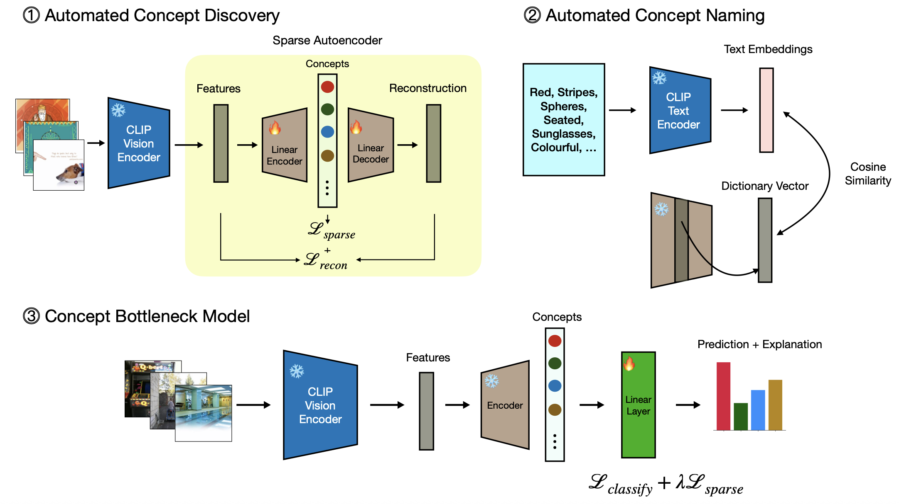

# SAE-Based Orthogonal Concepts Extraction from CLIP Embeddings

This repository contains the code for a course project developed for **Numerical Linear Algebra, Skoltech (2025)** by the team of:
- Stepan Epifantsev, DS-1  
- Valeria Yakupova, DS-1  
- Andrej Mymrin, DS-1  

## About

In [“Discover-then-Name: Task-Agnostic Concept Bottlenecks via Automated Concept Discovery”](https://arxiv.org/abs/2407.14499), it was suggested to use a Sparse Autoencoder (SAE) on CLIP embeddings to extract neurons aligned with human-interpretable concepts for further implementation in Concept Bottleneck Models (CBMs). This approach eliminates the need for manually labeling a concept set in the dataset, significantly reducing the amount of time spent on data collection.

However, CBMs are known to be prone to polysemantic concepts, which reduces model interpretability and limits the ability to intervene effectively.

The goal of this project is to explicitly enforce orthogonality between SAE concepts during training, thereby:
- reducing information leakage in the concept layer,
- improving concept disentanglement,
- increasing interpretability of learned representations.

## Overview
The "Discover-then-Name" framework extracts human-interpretable concepts from pretrained models in two stages:

1. **Discover:**  
   A Sparse Autoencoder (SAE) is trained on CLIP embeddings to learn selective latent neurons. Sparsity encourages each neuron to respond to a small set of features.

2. **Name:**  
   Each latent neuron is assigned a semantic label by finding the closest match in a vocabulary of text embeddings, linking latent features to human-understandable concepts.



In our implementation, we enhanced the SAE training to improve concept disentanglement by adding one of the following orthogonality losse to produce informative and interpretable concepts suitable for downstream CBMs:

- **Frobenius-norm regularization:**  
  Minimize concept embeddings correlations:
  Frobenius-norm regularization: $ \mathcal{L}_{F} = \| W^\top W - I \|_F^2 $

  $$
\mathcal{L}_{Ort} = \frac{1}{k} \sum_{i=1}^{k} \max_{j \neq i} \left( \frac{w_i^\top w_j}{\|w_i\| \, \|w_j\|} \right)^2
$$

- **Frobenius-norm regularization:**  
  Minimize concept embeddings correlations:  
  

- **OrtSAE constraints:**  
  Reduce the maximal cosine similarity of each concept embedding with all the others:  
  ^2)

- **SRIP regularization:**  
  Penalizes the spectral norm deviation of the Gram matrix from identity:  
  


  where $I$ is the identity matrix, and $W \in \mathbb{R}^{d \times k}$ is the SAE decoder weight matrix.

- **OrtSAE constraints:**  
  Reduce the maximal cosine similarity of each concept embedding with all the others:
    ```math
  \mathcal{L}_{Ort} = \frac{1}{k} \sum_{i=1}^{k} \max_{j \neq i} \left( \frac{w_i^\top w_j}{\|w_i\| \, \|w_j\|} \right)^2
    ```
  where $w_i$ and $w_j$ are columns of $W$.

- **SRIP regularization:**  
  Penalizes the spectral norm deviation of the Gram matrix from identity:
    ```math
  \mathcal{L}_{SRIP} = \| W^\top W - I \|_2
    ```

## Pipeline

Below are all steps required to reproduce the experiments and results.

<details>
<summary><strong>Click to expand the full project tree</strong></summary>

```text
.
├── pipeline/
│   ├── 01_cc3m_get_clip_embeddings/
│   │   └── extract_cc3m_embeddings.py
│   ├── 02_train_sae/
│   │   ├── sae_losses.py
│   │   └── train_sae.py
│   ├── 03_name_concepts/
│   │   ├── generate_vocab_embeddings.py
│   │   └── name_concepts.py
│   ├── 04_cifar10_get_clip_embeddings/
│   │   └── cifar10_get_clip_embeddings.py
│   ├── 05_cifar10_get_sae_embeddings/
│   │   └── cifar10_get_sae_embeddings.py
│   └── 06_train_cbm/
│   │   └── train_cbm.py
│   └── 07_collapse_sae_embeddings/
│       ├── collapse_sae.py
│       └── cifar10_concept_activations.ipynb
│
├── data/
│   ├── concept_names/
│   ├── datasets/
│   │   └── cc3m/
│   ├── embeddings/
│   │   ├── cc3m/
│   │   └── cifar10/
│   ├── sae_embeddings/
│   │   └── cifar10/
│   └── vocab/
│       └── 20k.txt
│
├── models/
│   ├── cbm/
│   ├── sae/
│   ├── sae_collapsed/
│   ├── sae_final_models/
│   └── sae_ort/
│
├── training_logs/
│   ├── sae/
│   ├── sae_ort/
│   └── cbm/
│
└── README.md
```
</details> 

### Step 0. Install requirements

Create and activate a virtual environment, then install dependencies:

```bash
python -m venv cbm_clip_sae
source cbm_clip_sae/bin/activate
pip install -r requirements
```


### Step 1. Get CLIP embeddings of CC3M dataset images

Download the ‘Train_GCC-training.tsv’ and ‘Validation_GCC-1.1.0-Validation.tsv’ from https://ai.google.com/research/ConceptualCaptions/download. Change their names to 
- cc3m_training.tsv 
- cc3m_test.tsv

***Note:*** Only the first 200,000 rows of the train file are used.

Add headers and download images:
```bash
sed -i '1s/^/caption\turl\n/' cc3m_training.tsv 

img2dataset --url_list cc3m_training.tsv --input_format "tsv" --url_col "url" --caption_col "caption" --output_format webdataset --output_folder training --processes_count 16 --thread_count 64 --image_size 256
```

```bash
sed -i '1s/^/caption\turl\n/' cc3m_test.tsv 

img2dataset --url_list cc3m_test.tsv --input_format "tsv" --url_col "url" --caption_col "caption" --output_format webdataset --output_folder test --processes_count 16 --thread_count 64 --image_size 256
```

The last two shards of training data are used as validation set.

Extract CLIP image embeddings:

```bash
python pipeline/01_cc3m_get_clip_embeddings.py/extract_cc3m_embeddings.py \
        --data_root data/datasets/cc3m \
        --train_dir training \
        --val_dir validation  \
        --test_dir test  \
        --train_range 00000..00047 \
        --val_range 00000..00001 \
        --test_range 00000..00001 \
        --output_dir data/embeddings/cc3m \
        --img_enc_name clip-RN50 \
        --batch_size 256 \
        --device cuda
```

### Step 2. Train SAE

Search for the optimal SAE dimensionality and sparsity coefficien (selected values: 4096, 1e-7):

```bash
bash pipeline/02_train_sae/choose_sae_params.sh 
```

Select orthogonality regularization strengths:
```bash
bash pipeline/02_train_sae/choose_orthogonal_losses.sh 
```

Train 4 SAE variants (no orthogonalization, Frobenius norm approach, OrtSAE method and SRIP):

```bash
bash pipeline/02_train_sae/run_chosen_models.sh 
```

Monitor training:

```bash
tensorboard --logdir ./training_logs/sae
```

### Step 3. Name concepts

Download the vocabulary of 20k words used by CLIP-Dissect (https://github.com/first20hours/google-10000-english/blob/master/20k.txt). 

Generate normalized CLIP text embeddings:

```bash
python pipeline/03_name_concepts/generate_vocab_embeddings.py
```

Assign names to SAE concepts by nearest text embeddings:

```bash
bash pipeline/03_name_concepts/name_concepts.py
```

### Step 4. Get CLIP embeddings of CIFAR-10 dataset images

Download CIFAR-10 and extract CLIP embeddings:

```bash
python pipeline/04_cifar10_get_clip_embeddings/cifar10_get_clip_embeddings.py \
    --data_root ./data/datasets \
    --output_dir ./data/embeddings/cifar10/
```

### Step 5. Get SAE embeddings of CIFAR-10 dataset images

Compute concept activations for all SAE models:

```bash
bash pipeline/05_cifar10_get_sae_embeddings/extract_concept_activations_cifar10.sh
```

### Step 6. Train CBM final layer

Train the CBM linear classifier with different sparsity levels:

```bash
bash pipeline/06_train_cbm/train_cbm.sh
```

Monitor training:

```bash
tensorboard --logdir ./training_logs/cbm
```

## References

- **Sukrut Rao, Sweta Mahajan, Moritz Böhle, and Bernt Schiele (2024).**  
  [**Discover-then-Name: Task-Agnostic Concept Bottlenecks via Automated Concept Discovery**](https://arxiv.org/abs/2407.14499)

- **Anton Korznikov, Andrey Galichin, Alexey Dontsov, Oleg Rogov, Elena Tutubalina, and Ivan Oseledets (2025).**  
  [**ORTSAE: Orthogonal Sparse Autoencoders Uncover Atomic Features**](https://arxiv.org/abs/2509.22033)


- **Nitin Bansal, Xiaohan Chen, and Zhangyang Wang (2018).**  
  [**Can We Gain More from Orthogonality Regularizations in Training Deep CNNs?**](https://arxiv.org/abs/1810.09102)
